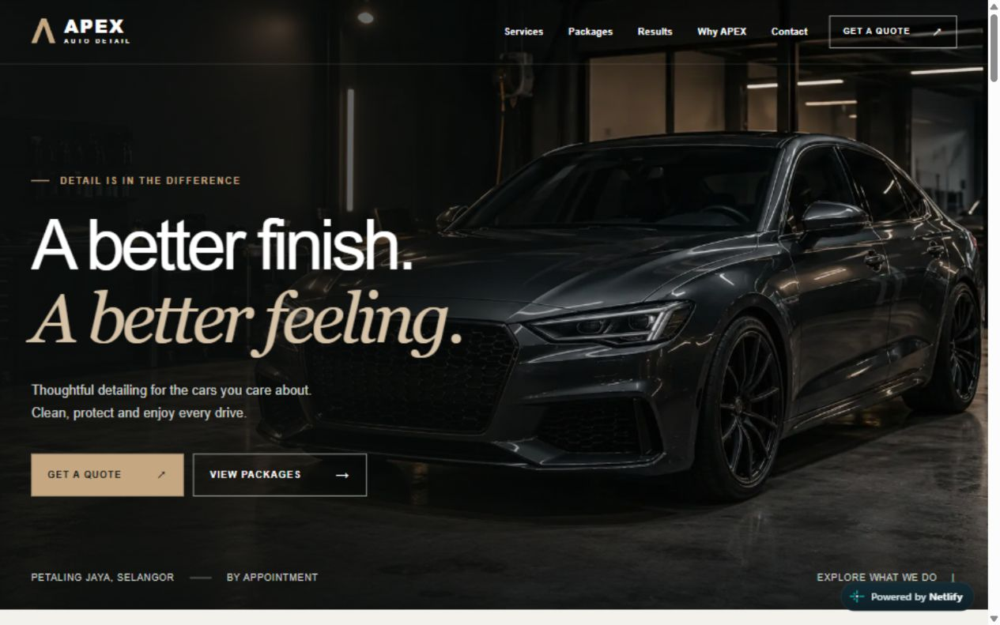

# APEX Auto Detail

A small-business website concept for a **fictional Malaysian automotive detailing studio**, built with Next.js, React, and TypeScript. The project explores how a clear service overview, considered visuals, and comfortable mobile interactions can bring a business idea to life.

[Visit the live demo](https://apex-auto-detail-demo.netlify.app/) · [Read the project story](docs/case-study.md)



## What you can explore

- Four service categories with matching imagery and icons
- Sample packages in Malaysian ringgit, FAQs, and studio information
- An interactive before/after comparison with touch, mouse, and keyboard controls
- Responsive navigation with keyboard focus and Escape support
- WhatsApp links with prepared quote messages and a Maps link based on the configured address

This is a presentation demo, not an operating business. Business details, prices, reviews, and generated imagery are labelled as samples. The WhatsApp number and address are placeholders; quote links do not represent a real booking service. Search indexing remains disabled with `noindex, nofollow`.

## How it was made

Jarrell guided the project, gathered feedback, reviewed the design, and tested it on a laptop and a Xiaomi 12T Pro. Codex assisted with design, implementation, generated imagery, and technical checks. The [case study](docs/case-study.md) describes that collaboration and the mobile scrolling issue that shaped the final slider.

The site uses Next.js 16 App Router, React 19, TypeScript, CSS, and local images served through `next/image`. It is hosted on Netlify with automatic deployment from GitHub. There is no backend, booking system, or analytics integration.

## Run locally

```bash
npm ci
npm run dev
```

Open `http://localhost:3000`.

```bash
npm run typecheck
npm run build
npm run start
```

The last command serves the production build locally.

## Project files

| Location                 | Purpose                                                     |
| ------------------------ | ----------------------------------------------------------- |
| `src/app/`               | Page layout, styles, and metadata                           |
| `src/components/`        | Navigation, branding, icons, and comparison slider          |
| `src/config/business.ts` | Business details, packages, FAQs, reviews, and quote links  |
| `public/images/`         | Images used by the website                                  |
| `docs/`                  | Case study, selected screenshots, and service image prompts |

Dependencies, build output, environment files, logs, and the local audit are excluded from Git. The screenshots in `docs/screenshots/` are a small selection captured from the published demo.

## Configuration and real-world use

Update business content in `src/config/business.ts`, page copy in `src/app/page.tsx`, and metadata in `src/app/layout.tsx`. The [service image prompts](docs/service-image-prompts.md) document the four generated service visuals.

Before adapting the site for a real business, verify and replace the sample contact details, address, hours, prices, reviews, and imagery. Use licensed or permissioned customer material, update the disclosures and metadata, and remove `noindex, nofollow` only when the real details are ready.
