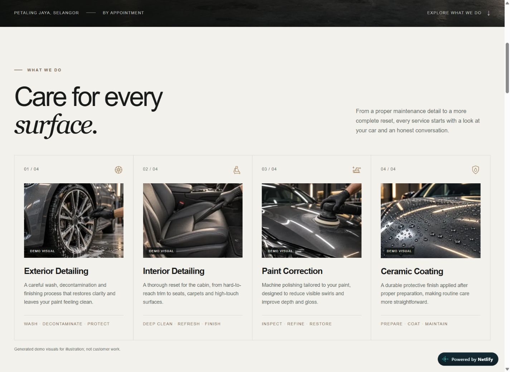
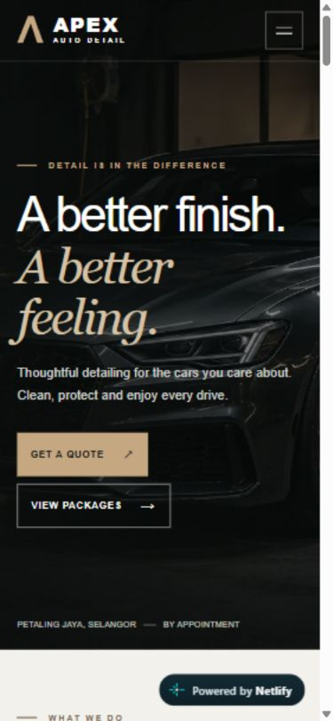
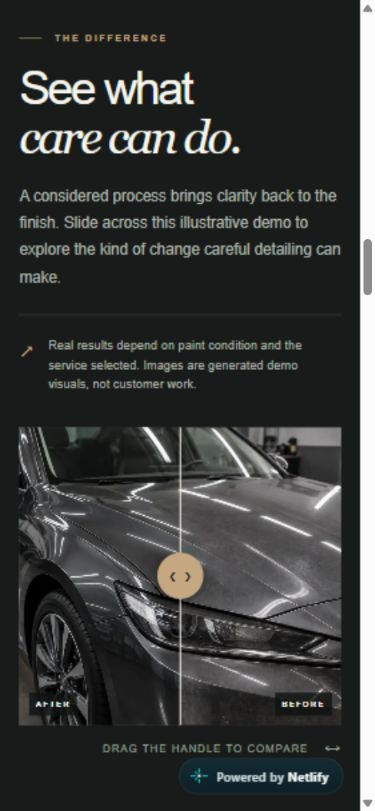

# APEX Auto Detail: from an idea to a working website

[Explore the live demo](https://apex-auto-detail-demo.netlify.app/) · [Back to the project](../README.md)

The part I am proudest of is seeing an idea become a website that people can actually open and use. APEX started as a fictional Malaysian detailing studio. It became a complete demo that I could share, review on my laptop, and test on my own phone.

## Starting with the visitor

I did not come into this project with experience in car detailing. That made a simple question useful: would someone unfamiliar with the subject understand what the studio offers?

The page introduces four services, shows sample packages, explains what to expect, and gives visitors a clear way to ask for a quote. Everything stays on one page, with navigation to the main sections.

## Finding the right look

The design combines dark automotive imagery, warm gold accents, and lighter sections that give the information room to breathe. Large headings pair straightforward type with a softer italic style. The aim was a calm, polished feel that still works on a small screen.

My first reviewer suggested adding more images. Four service visuals and matching icons gave each category something recognisable: wheel cleaning, cabin care, paint polishing, and protective water beading. We kept the existing typography and layout so the addition felt like part of the same design.

## The phone test that mattered

The before/after slider looked fine on a laptop, but on my phone it caught vertical swipes and made the page awkward to scroll. Allowing vertical panning solved that problem, then exposed another: horizontal finger dragging stopped working.

The final solution allows the browser to handle vertical scrolling and adds a small touch gesture handler for horizontal movement. The native range input still supports mouse dragging, keyboard arrows, and a visible focus ring.

I tested the published version on my Xiaomi 12T Pro and confirmed that both gestures worked smoothly. That was a useful reminder that a good desktop preview cannot tell the whole story.

  
  

These are browser screenshots at a phone viewport. The gesture check was performed separately on the physical phone.

## Working with AI

I guided the project, gathered feedback, reviewed the results, and tested the experience. Codex assisted with design, coding, imagery, and technical checks. I am presenting this as an AI-assisted project, with my contribution in directing the work and deciding when it felt ready.

## Where it landed

APEX is published on Netlify from its GitHub repository. Before release, type checking and the production build passed. Reviews covered responsive overflow, navigation, FAQs, quote links, mouse and keyboard controls, and visible focus. The hosted demo was checked again, including the phone gestures.

It remains a fictional portfolio demo. Prices, contact details, reviews, and generated visuals are labelled as samples, and `noindex, nofollow` remains in place. There are no real customer results, booking transactions, or business performance claims behind it.
